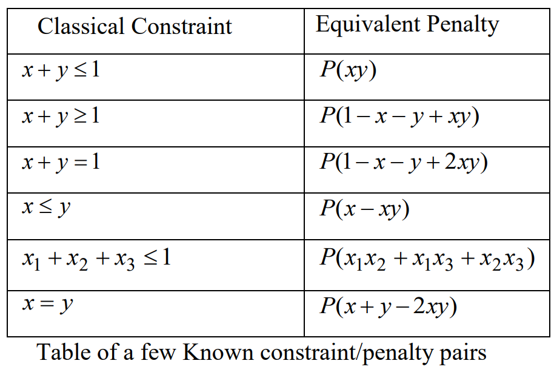

# 10のメジャーな組合せ最適化問題におけるQUBO行列生成コードの実装

- 参考：[A Tutorial on Formulating and Using QUBO Models](http://meta-analytics.net/references/QUBO%20Tutorial%20%20Version%201-4.pdf)


```python
from __future__ import annotations
from itertools import combinations
from dwave_qbsolv import QBSolv
from typing import Set, Tuple, Container, Dict, Sequence
from dataclasses import dataclass
import networkx as nx
```

- qubo行列は`np.ndarray`で表すことにする
- しかしdwave_qbsolvに渡すには`dict`にする必要があるので，helper functionを用意しておく


```python
def to_dict(q: np.ndarray) -> Dict[Tuple[int, int], float]:
    """Returns q matrix in the form of dict from np.ndarray
    
    The dict can be directly passed to dwave_qbsolv.QBSolv
    """
    assert len(q.shape) == 2 and  q.shape[0] == q.shape[1]
    return dict(zip(zip(*np.nonzero(q)), q[q!=0]))
```

- test code


```python
def test_to_dict():
    q = np.array([[1,2],
                  [2,4]])
    assert to_dict(q) == {(0,0):1, (0,1):2, (1,0):2, (1,1):4}
test_to_dict()
```

- `np.ndarray`のQUBO行列から解を得るfunctionも用意しておく


```python
def qbsolv_from_ndarray(q: np.ndarray) -> Tuple[np.ndarray, np.ndarray]:
    """Returns lowest energy samples from dwave qbsolv.(for test util)"""
    res = QBSolv().sample_qubo(to_dict(q)).record
    i = res.energy == res.energy.min()
    return res.sample[i], res.energy[i]
```

#  The Number Partitioning Problem

- [Partition problem \- Wikipedia](https://en.wikipedia.org/wiki/Partition_problem)
- 数の集合を2つに分割したとき，それぞれの和が一致するような分け方はあるか？
- 集合の要素にqubitを$x_{i}$を割り当てる
    - 分割後の集合kに入る場合は$x_{i}=k$


```python
def qubo_number_partition(number_set: Container[float]) -> np.ndarray:
    """Return Q matrix of number partitioning problem
    
    Math:
        q_{ii} = s_{i}(s_{i}-c) \\
        q_{ij} = q_{ji} = s_{i}s_{j} \\
        c = \sum_i{s_{i}}
    """
    number_set = np.array(list(number_set))
    c = number_set.sum()
    q = np.outer(number_set, number_set)
    np.fill_diagonal(q, number_set*(number_set-c))
    return q
```

- test


```python
def test_qubo_number_partition():
    s = np.array([3,1,1,2,2,1])
    sample, _ = qbsolv_from_ndarray(qubo_number_partition(s))
    assert s[sample[0] == 1].sum() == 5
    assert s[sample[0] == 0].sum() == 5
test_qubo_number_partition()
```

# The Max-Cut Problem

- https://en.wikipedia.org/wiki/Maximum_cut
- 先程と同じく，各ノードに対してqubitを割り当て，2つの集合に分けることを考える
- エッジ(i,j)に対して，$(x_{i}-x_{j})^2=1$のとき，$(i,j)$がカットに含まれることを利用する
- 後々グラフを扱う問題がいくつか出てくるので，Graph Classを用意する
    - データ形式のチェックなどはこれに任せる．（とりあえずは最低限のチェックのみ実装する）
    - networkxとのやり取り機能をつけておく


```python
@dataclass
class Graph:
    edges: Collection[Collection[int]] # edge is represented as (i, j)
    n_nodes: int
    init_value: Mapping[int, int] = None # init_value[i] indicates init value of node i
    nodes: Sequence[float] = None # value of nodes. len(nodes) must be n_nodes
     
    def __post_init__(self):
        if self.nodes is not None: assert len(self.nodes) == self.n_nodes 
        if self.edges is None: return
        if len(self.edges) == 0: 
            self.edges = None
            return
        self.edges = np.array(list(self.edges))
        assert self.edges.max() < self.n_nodes
        assert self.edges.shape[1] == 2
        if self.init_value is not None:
            assert all(np.array(list(self.init_value)) < self.n_nodes)
        
    @classmethod
    def from_networkx(cls, graph: nx.Graph) -> Graph:
        return cls(edges = graph.edges, n_nodes = graph.number_of_nodes())
    
    def to_networkx_graph(self) -> nx.Graph:
        nxg = nx.Graph()
        nxg.add_nodes_from(range(self.n_nodes))
        nxg.add_edges_from(self.edges)
        return nxg
```

- test


```python
def test_graph():
    edges = {(1,2), (3,4)}
    graph = Graph(edges, 5)
    assert graph.edges.shape == (2,2)
    nxg = graph.to_networkx_graph()
    _graph = Graph.from_networkx(nxg)
    assert np.array_equal(graph.edges, _graph.edges)
    assert graph.n_nodes == _graph.n_nodes
test_graph()
```

- max-cut 実装


```python
def qubo_max_cut(g: Graph) -> np.ndarray:
    n_nodes = g.n_nodes
    q = np.zeros((n_nodes, n_nodes))
    i, j = g.edges.T
    np.add.at(q, (i,i), -1)
    np.add.at(q, (j,j), -1)
    q[i,j] += 1
    q[j,i] += 1
    return q
```

- test
    - test用のhelper functionを用意しておく


```python
def is_contain(x: np.ndarray, y: np.ndarray) -> bool:
    """If y \in x"""
    assert len(x.shape) -1 == len(y.shape)
    return any(np.array_equal(xi, y) for xi in x)
```


```python
def test_qubo_max_cut():
    edges = [(0,1), (0,2), (1,3), (2,3), (2, 4), (3, 4)]
    g = Graph(edges=edges, n_nodes=5)
    q = qubo_max_cut(g)
    assert q.tolist() == [[-2,1,1,0,0],
                          [1,-2,0,1,0],
                          [1,0,-3,1,1],
                          [0,1,1,-3,1],
                          [0,0,1,1,-2]]
    sample, _ = qbsolv_from_ndarray(q)
    assert is_contain(sample, np.array([0,1,1,0,0]))
test_qubo_max_cut()
```

# known penalties

- 上の2つのモデルは，制約式がなかったため非常に簡単にQUBOモデルにできた
- しかし制約がある場合はどうしたらよいか？一般的に下の表が役に立つ （[A Tutorial on Formulating and Using QUBO Models](http://meta-analytics.net/references/QUBO%20Tutorial%20%20Version%201-4.pdf)


# The Minimum Vertex Cover Problem (MVC)

- [Vertex cover \- Wikipedia](https://en.wikipedia.org/wiki/Vertex_cover)
- グラフのすべての枝について，端点の少なくとも一方が属するような頂点の部分集合を求める問題


```python
def qubo_mvc(g: Graph, penalty: float = 10.):
    """The Minimum Vertex Cover Problem (MVC)
    
    Math:
        y = \sum_{j \in V}x_{j} + P\left(\sum_{(i,j) \in E}\left(1-x_{i}-x_{j}+x_{i}x_{j}\right)\right)
    """
    q = np.diagflat(np.ones(g.n_nodes))
    i, j = g.edges.T
    np.add.at(q, (i,i), -penalty)
    np.add.at(q, (j,j), -penalty)
    q[i,j] += penalty/2.
    q[j,i] += penalty/2.
    return q
```

- test


```python
def test_qubo_mvc():
    edges = [(0,1), (0,2), (1,3), (2,3), (2, 4), (3, 4)]
    g = Graph(edges=edges, n_nodes=5)
    q = qubo_mvc(g, penalty=8.)
    sample,_ = qbsolv_from_ndarray(q)
    assert is_contain(sample, np.array([0,1,1,0,1]))
test_qubo_mvc()
```

# The Weighted Minimum Vertex Cover Problem (W-MVC)

- MVCの重み付きバージョン


```python
def qubo_wmvc(g: Graph, penalty: float = 10.):
    """The Minimum Vertex Cover Problem (MVC)
    
    Math:
        y = \sum_{j \in V}w_{j}x_{j} + P\left(\sum_{(i,j) \in E}\left(1-x_{i}-x_{j}+x_{i}x_{j}\right)\right)
    """
    q = np.diagflat(np.ones(g.n_nodes)*g.nodes)
    i, j = g.edges.T
    np.add.at(q, (i,i), - penalty*g.nodes[i])
    np.add.at(q, (j,j), - penalty*g.nodes[j])
    q[i,j] += penalty/2.
    q[j,i] += penalty/2.
    return q
```

- test
    - めんどいので重みは全部1にする


```python
def test_qubo_wmvc():
    edges = [(0,1), (0,2), (1,3), (2,3), (2, 4), (3, 4)]
    g = Graph(edges=edges, n_nodes=5, nodes=np.ones(5))
    q = qubo_wmvc(g, penalty=8.)
    sample, _ = qbsolv_from_ndarray(q)
    assert is_contain(sample, np.array([0,1,1,0,1]))
test_qubo_wmvc()
```

## Remarks about the scalar penalty P

> Generally, there is a ‘Goldilocks region’ of considerable size that contains penalty values that work well. A little preliminary thought about the model can yield a ballpark estimate of the original objective function value. Taking P to be some percentage (75% to 150%) of this estimate is often a good place to start. 

# The Set Packing Problem
- [Set packing \- Wikipedia](https://en.wikipedia.org/wiki/Set_packing)


```python
def qubo_set_pack(a: np.ndarray, weight: np.ndarray, penalty=8.) -> np.ndarray:
    """Set Packing Problem
    
    Math:
        min\ \sum_{j=1}^n w_{j}x_{j} \\
        st \\
        \sum_{j=1}^n a_{ij}x_{j} \le 1
    """
    assert len(a.shape) == 2
    assert a.shape[-1] == len(weight)
    q = -np.diagflat(weight)
    c = np.einsum("ij,ik->ijk",a,a).astype(np.float) / 2. # constraint
    c *= (1 - np.eye(a.shape[-1]))[None,...] # zeros diag
    q += penalty*c.sum(0)
    return q
```

- test


```python
def test_qubo_set_pack():
    a = np.array([[1,0,1,1],
                  [1,1,0,0]])
    w = np.ones(4)
    q = qubo_set_pack(a, w, penalty=6.)
    assert q.tolist() == [[-1,3,3,3],
                         [3,-1,0,0],
                         [3,0,-1,3],
                         [3,0,3,-1]]
    assert is_contain(qbsolv_from_ndarray(q)[0], np.array([0,1,1,0]))
test_qubo_set_pack()
```

# The Max 2-Sat Problem
- [Boolean satisfiability problem \- Wikipedia](https://en.wikipedia.org/wiki/Boolean_satisfiability_problem)
- 面白いことに，Clauseの数によらないモデルとなる
- Clauseのデータ型を定義しておく
    - リテラルが否定なら sign = False


```python
@dataclass
class Clauses:
    literals: np.ndarray[int]
    signs: np.ndarray[bool]
    def __post_init__(self):
        assert len(self.literals) == len(self.signs)
```

- 実装


```python
def qubo_max2sat(c: Clauses):
    n = c.literals.max()+1
    q = np.zeros((n,n))
    i,j=c.literals.T
    si,sj=c.signs.T
    np.add.at(q, (i[sj], i[sj]), ((-1)**si)[sj])
    np.add.at(q, (j[si], j[si]), ((-1)**sj)[si])

    offdiag=np.zeros_like(q)
    np.add.at(offdiag, (i,j), (-1)**(si^sj) / 2.)
    return offdiag + offdiag.T + q
```

- test


```python
def test_qubo_max2sat():
    l = np.array([[0,1],[0,1],[0,1],[0,1],[0,2],
                  [0,2],[1,2],[1,3],[1,2],[1,2],
                  [2,3],[2,3]])
    s = np.array([[True,True],[True,False],[False,True],[False,False],
                  [False,True],[False,False],[True,False],[True,True],
                  [False,True],[False,False],[True,True],[False,False]])
    q = qubo_max2sat(Clauses(l,s))
    assert q.tolist() == [[1,0,0,0],
                          [0,0,-0.5,0.5],
                          [0,-0.5,0,1],
                          [0,0.5,1,-2]]
    sample, _ = qbsolv_from_ndarray(q)
    assert is_contain(sample, np.array([0,0,0,1]))
test_qubo_max2sat()
```

# The Set Partitioning Problem (SPP)
- [Partition of a set \- Wikipedia](https://en.wikipedia.org/wiki/Partition_of_a_set)
- この問題ではqubitは集合の要素ではなく，部分集合を表す
- SPPはクラスタリングともみなすことができ，機械学習との関連が資料の中で紹介されている


```python
def qubo_spp(cost: np.ndarray, set_flag: np.ndarray, p=10.):
    """The Set Partitioning Problem (SPP)
    
    Args:
        set_flag: 2-rank array. (i,j) = 1 if element i in set j.
    """
    assert cost.shape[0] == set_flag.shape[1]
    b = np.ones(set_flag.shape[0])
    return np.diagflat(cost - p*2*b.dot(set_flag))  + p*np.einsum("ij,ik->jk",set_flag,set_flag)
```

- test


```python
def test_qubo_spp():
    c = np.array([3,2,1,1,3,2])
    a = np.array([[1,0,1,0,0,1],
                  [0,1,1,0,1,1],
                  [0,0,1,1,1,0],
                  [1,1,0,1,0,1]])

    q=qubo_spp(c, a)
    assert q.tolist() == [[-17,10,10,10,0,20],
                        [10,-18,10,10,10,20],
                        [10,10,-29,10,20,20],
                        [10,10,10,-19,10,10],
                        [0,10,20,10,-17,10],
                        [20,20,20,10,10,-28]]
    sample, _ = qbsolv_from_ndarray(q)
    assert is_contain(sample, np.array([1,0,0,0,1,0]))
test_qubo_spp()
```

# Graph Coloring
- [Graph coloring \- Wikipedia](https://en.wikipedia.org/wiki/Graph_coloring)
- 応用範囲が広い
    - スケジューリング，基板デザイン，レジスタ割付
    - 以前[数独の実装](https://qiita.com/tamurahey/items/105f1dc9ee9a3bc01f15)をした
- ノードiが色jで塗られるとき，qubitを1とする
    - つまり見通しを良くするために，qubitは行列で，qubo行列は4階のndarrayで表現する


```python
def qubo_graph_coloring(g: Graph, n_color, penalty=10.) -> np.ndarray:
    """Graph Coloring"""
    n = g.n_nodes
    q=np.zeros((n,n_color,n,n_color))
    
    # each nodes are colored by one color
    i=range(n)
    q[i, :, i, :] = penalty*(np.ones((n_color,n_color)) - 2*np.eye(n_color))
    
    # adjacent nodes are not colored with same color
    i, j = g.edges.T[...,None]
    k=range(n_color)
    q[i,k,j,k]+=penalty/2.
    q[j,k,i,k]+=penalty/2.
    
    return q.reshape(n*n_color,n*n_color)
```


```python
def test_qubo_graph_coloring():
    edges = [[0,1],[0,4],[1,2],[1,3],[1,4],[2,3],[3,4]]
    n_nodes, n_color=5, 3
    g = Graph(edges=edges, n_nodes=n_nodes)
    ans=np.zeros(n_nodes*n_color)
    ans[[1,3,8,10,14]]=1
    q=qubo_graph_coloring(g, n_color, penalty=4.)
    assert is_contain(qbsolv_from_ndarray(q)[0],ans)
test_qubo_graph_coloring()
```

> This approach to coloring problems has proven to be very effective for a wide variety of coloring instances with hundreds of nodes.

らしい.n_color色に対してn_color qubitを用意しているが，log_2(n_color)ですむような構成法はないか？

# General 0/1 Programming

> Many important problems in industry and government can be modeled as 0/1 linear programs with a mixture of constraint types.

- 不等式制約をslack変数の導入によってQUBOに入れている点が面白い


```python
def qubo_general01(cost, a, b, sign, penalty=10.):
    """General 0/1 Programming
    
    Args:
        a, b: constraint (ax=b)
        sign: 0 is equality, 1 is >=, -1 is <=
    """
    slack = - sign * b
    slack[sign==0] = 1.
    slack[sign == 1] += a[sign==1,:].sum()
    slack = np.ceil(np.log2(slack)).astype(np.int)

    ni = a.shape[0]
    for i, ns in enumerate(slack):
        if ns:
            t = np.zeros((ni,ns))
            t[i] = -sign[i]*2**np.arange(ns)
            a=np.concatenate([a,t],-1)
            
    return - np.diagflat(np.concatenate([cost, np.zeros(sum(slack))])+2*penalty*b.dot(a)) + penalty*np.einsum("ij,ik->jk",a,a) 
```

- test


```python
def test_qubo_general01():
    c = np.array([6,4,8,5,5])
    a = np.array([[2,2,4,3,2],
                  [1,2,2,1,2],
                  [3,3,2,4,4]])
    b = np.array([7,4,5])
    s = np.array([-1,0,1])
    q=qubo_general01(c,a,b,s)
    sample, _=qbsolv_from_ndarray(q)
    assert is_contain(sample[:,:5], np.array([1,0,0,1,1]))
test_qubo_general01()
```

# Quadratic Assignment Problem (QAP)

- [Quadratic assignment problem \- Wikipedia](https://en.wikipedia.org/wiki/Quadratic_assignment_problem)k
- 工場の配置など


```python
def qubo_qap(flow:np.ndarray, distance: np.ndarray, penalty=10.):
    """Quadratic Assignment Problem (QAP)"""
    n = len(flow)
    q = np.einsum("ij,kl->ikjl",flow, distance).astype(np.float)

    i = range(len(q))
    q[i,:,i,:] += penalty
    q[:,i,:,i] += penalty
    q[i,i,i,i] -= 4*penalty
    return q.reshape(n**2,n**2)
```


```python
def test_qubo_qap():
    flow = [[0,5,2],
            [5,0,3],
            [2,3,0]]
    distance = [[0,8,15],
                [8,0,13],
                [15,13,0]]
    q = qubo_qap(flow, distance, penalty=200.)
    sample, _ = qbsolv_from_ndarray(q)
    assert is_contain(sample, np.array([1,0,0,0,1,0,0,0,1]))
test_qubo_qap()
```

# Quadratic Knapsack Problem (QKP)

- 2次のナップサック問題

> widespread application in such areas as project selection and capital budgeting.

> In such settings, a set of attractive potential projects is identified and the goal is to identify a subset of maximum value (or profit) that satisfies the budget limitations.
> The quadratic version of this problem arises when there is an interaction between pairs of projects affecting the value obtained.


```python
def qubo_qkp(value:np.ndarray, a:np.ndarray, b:float, penalty=10.) -> np.ndarray:
    """Quadratic Knapsack Problem (QKP)"""
    n = len(value)
    nslack = np.ceil(np.log2(b))
    slack = 2 ** (np.arange(nslack))
    a = np.concatenate([a,slack])
    q = penalty*(np.outer(a,a) - 2*b*np.diag(a))
    q[:n,:n] -= value
    return q
```


```python
def test_qubo_qkp():
    value = np.array([[2,4,3,5],
                      [4,5,1,3],
                      [3,1,2,2],
                      [5,3,2,4]])
    a = np.array([8,6,5,3])
    b = 16
    q = qubo_qkp(value, a, b, penalty=10.)
    sample, _ = qbsolv_from_ndarray(q)
    n = len(a)
    assert is_contain(sample[:,:n], np.array([1,0,1,1]))
test_qubo_qkp()
```

> The QUBO approach to QKP has proven to be successful on problems with several hundred variables and as many as five knapsack constraints.
